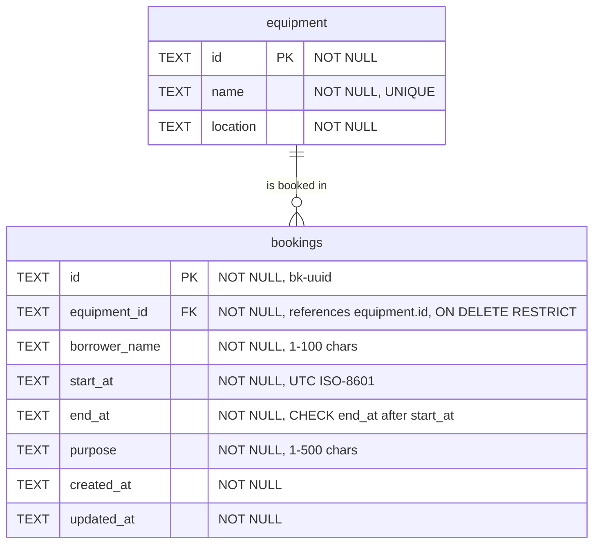

# CampusLend — Campus Equipment Booking API

REST API for booking shared campus equipment (projectors, cameras, laptops, microcontroller kits) without double-booking.
1305308 Platform Development — Midterm Practical Lab.

## Links
| | |
|---|---|
| GitHub repository | https://github.com/daniellejusayan/campuslend |
| Live API (Cloudflare Workers + D1) | https://campuslend.mykanbanboard.workers.dev/api |
| Base API URL used for testing | local: `http://localhost:8787/api` · deployed: `https://campuslend.mykanbanboard.workers.dev/api` |

Opening `/` or `/api` in a browser shows a JSON list of all endpoints.

## Submission checklist
| Required item | Where |
|---|---|
| Runnable source code + run instructions | `src/`, `migrations/`, this README → [Run locally](#run-locally) |
| API contract | [API_CONTRACT.md](API_CONTRACT.md) |
| Schema / ERD | this README → [Database schema (ERD)](#database-schema-erd) |
| AI log | [AI_LOG.md](AI_LOG.md) |
| Quality Gate review | [QUALITY_GATE_REVIEW.md](QUALITY_GATE_REVIEW.md) |
| ≥ 5 test cases + Base API URL | this README → [Test evidence](#test-evidence), full runs in [docs/evidence-local.md](docs/evidence-local.md) and [docs/evidence-cloudflare.md](docs/evidence-cloudflare.md) |
| GitHub + Cloudflare links | this README → [Links](#links) |

## Stack
Hono (TypeScript) · Cloudflare Workers · Cloudflare D1 (SQLite) · Zod (validation) · Wrangler (local runtime, migrations, deploy)

## Run locally
Requires **Node.js 18+** (tested with Node 25 on Windows 11). Nothing else: no curl, jq or bash needed.
Commands are the same in PowerShell, cmd, Git Bash and macOS/Linux terminals.

```bash
npm install          # 1. dependencies (wrangler is installed locally, no global install)
npm run migrate      # 2. create the local D1 database: tables, seed equipment eq-1..eq-4, overlap triggers
npm run dev          # 3. start the API on http://localhost:8787  (leave this terminal open)
```
In a **second terminal**:
```bash
npm test             # runs 70 checks against http://localhost:8787 -> writes docs/evidence-local.md
npm run test:guide   # only the exam's 9-step cURL sequence -> writes docs/guide-results.md
npm run typecheck    # TypeScript check
```
`npm test` empties the bookings table before and after the run so results are repeatable (equipment is kept).

Quick manual check (PowerShell needs `curl.exe`, not `curl`):
```bash
curl.exe http://localhost:8787/api/equipment
curl.exe -X POST http://localhost:8787/api/bookings -H "Content-Type: application/json" -d "{\"equipmentId\":\"eq-1\",\"borrowerName\":\"Somchai\",\"startAt\":\"2026-10-20T09:00:00Z\",\"endAt\":\"2026-10-20T11:00:00Z\",\"purpose\":\"Class presentation\"}"
```

### Troubleshooting
| Symptom | Fix |
|---|---|
| `Cannot reach http://localhost:8787/api` | Start the server: `npm run dev` |
| Every request returns 500 / `no such table` | The local DB is empty: `npm run migrate` |
| `Address already in use` on 8787 | Another `wrangler dev` is running; close it or use `npx wrangler dev --port 8788` and `npm test -- --base http://localhost:8788` |
| `Not logged in` / token expired (deploy only) | `npx wrangler login` |
| `npm warn allow-scripts ... esbuild, workerd` during install (npm 11) | Harmless: their binaries come from platform packages. Verified: a fresh copy installs, migrates, runs and passes `npm test` with this warning |

## Deploy to Cloudflare
Already deployed at `https://campuslend.mykanbanboard.workers.dev` (D1 database `campuslend-db`, region APAC; its id is in
`wrangler.jsonc`). To redeploy after a code change: `npm run deploy`. To set it up from scratch on another account:
```bash
npx wrangler login                          # opens the browser; approve access
npx wrangler d1 create campuslend-db        # prints a database_id
#   -> paste that database_id into wrangler.jsonc (d1_databases[0].database_id)
npm run migrate:remote                      # create tables, seed data and triggers in the cloud database
npm run deploy                              # prints https://campuslend.<your-subdomain>.workers.dev
```
Test the deployed API (empties bookings in the **remote** database before and after):
```bash
npm test -- --remote --base https://campuslend.mykanbanboard.workers.dev   # -> docs/evidence-cloudflare.md
```
Note: changing `database_id` also changes which local database `wrangler dev` uses, so run `npm run migrate` again afterwards.

## Endpoints
Base URL: `http://localhost:8787/api` (local) or `https://campuslend.mykanbanboard.workers.dev/api` (deployed).

| Method | Path | Success | Errors |
|---|---|---|---|
| GET | `/` or `/api` | 200 | – (endpoint index) |
| GET | `/api/equipment` | 200 | – |
| GET | `/api/bookings` | 200 | – |
| GET | `/api/bookings/:id` | 200 | 404 |
| POST | `/api/bookings` | 201 | 400, 404 (equipment), 409 (overlap) |
| PATCH | `/api/bookings/:id` | 200 | 400, 404, 409 |
| DELETE | `/api/bookings/:id` | 204 (empty body) | 404 |

Success body: `{"success": true, "data": ...}`. Error body: `{"error": "<message>", "code": "<CODE>"}`.
Payloads, error codes and assumptions: [API_CONTRACT.md](API_CONTRACT.md).

## Database schema (ERD)

- **One equipment has many bookings**; each booking belongs to exactly one equipment (foreign key).
- Index `(equipment_id, start_at, end_at)` serves the overlap query. Two triggers refuse overlapping rows on INSERT and UPDATE.
- Timestamps are fixed-width UTC ISO-8601 `TEXT` (SQLite has no date type), so text comparison equals time comparison.
- Source: [migrations/0001_init.sql](migrations/0001_init.sql), seed [0002_seed.sql](migrations/0002_seed.sql), triggers [0003_overlap_guard.sql](migrations/0003_overlap_guard.sql).

## Business rules and validation
- **No double booking:** two bookings of the same equipment overlap when `newStart < existingEnd AND newEnd > existingStart` → **409**.
  Back-to-back (11:00–13:00 after 09:00–11:00) is allowed; the same time on different equipment is allowed.
  One function, `assertBookable()` in `src/bookings-db.ts`, enforces this for POST **and** PATCH; PATCH excludes the booking itself.
- **Validation (Zod):** all five fields required on POST; PATCH accepts any subset (≥ 1) and validates the *merged* booking;
  `startAt`/`endAt` must be ISO-8601 **with timezone**; `endAt` must be after `startAt` → otherwise **400**.
- Unknown `equipmentId` or booking id → **404**. Invalid JSON → **400**. Unexpected failures → generic **500**, details only in the server log.

## Security
- **SQL parameter binding:** every query is a constant string with `?` placeholders and `.bind()`; no request data is concatenated into SQL.
- **Validation** in the API *and* constraints in the database (NOT NULL, UNIQUE, CHECK, FOREIGN KEY, triggers).
- **Errors** never contain stack traces or SQL (verified with a real SQLite failure: [docs/error-500-check.txt](docs/error-500-check.txt)).
- **CORS:** only origins in `ALLOWED_ORIGINS` (`wrangler.jsonc`) get CORS headers. This is a browser rule, not authentication.
- **Authentication / authorization:** not implemented; the requirements have no user concept (`borrowerName` is free text), so
  anyone who can reach the API can read or change any booking. This is a stated limitation.
- **Secrets:** none required. `.dev.vars` is git-ignored.

## Test evidence
`npm test` sends real HTTP requests to the running API, compares expected vs actual status, checks the response body, and asserts the
`{"error": string}` shape on every error. Every request and response is in the full evidence files.

| Run | Base API URL used for testing | Database | Result | Evidence |
|---|---|---|---|---|
| Local (2026-10-06) | `http://localhost:8787/api` | local D1 (`wrangler dev`) | **70 passed, 0 failed** | [docs/evidence-local.md](docs/evidence-local.md) |
| Cloudflare (2026-10-06) | `https://campuslend.mykanbanboard.workers.dev/api` | remote D1 `campuslend-db` | **70 passed, 0 failed** | [docs/evidence-cloudflare.md](docs/evidence-cloudflare.md) |

Key cases (actual status was identical in both runs):

| # | Test case | Request | Expected | Local | Cloudflare | Result |
|---|---|---|---|---|---|---|
| 1 | List equipment | `GET /api/equipment` | 200 | 200 | 200 | PASS |
| 2 | List bookings | `GET /api/bookings` | 200 | 200 | 200 | PASS |
| 3 | Create booking | `POST /api/bookings` eq-1 09:00–11:00 | 201 | 201 | 201 | PASS |
| 4 | Get booking | `GET /api/bookings/:id` | 200 | 200 | 200 | PASS |
| 5 | Update booking | `PATCH /api/bookings/:id` `{"purpose": ...}` | 200 | 200 | 200 | PASS |
| 6 | Invalid time range | `POST` with endAt before startAt | 400 | 400 | 400 | PASS |
| 7 | Overlapping booking | `POST` eq-1 10:00–12:00 | 409 | 409 | 409 | PASS |
| 8 | Missing booking | `GET /api/bookings/bk-does-not-exist` | 404 | 404 | 404 | PASS |
| 9 | Delete booking | `DELETE /api/bookings/:id` | 204 | 204 | 204 | PASS |
| 10 | Back-to-back booking | `POST` eq-1 11:00–13:00 | 201 | 201 | 201 | PASS |
| 11 | PATCH into another booking's slot | `PATCH` B → 09:00–11:00 | 409 | 409 | 409 | PASS |
| 12 | SQL injection as input | `POST` borrowerName `' OR 1=1 --` | 201, stored as text | 201 | 201 | PASS |

Quality Gate history: [docs/guide-before-fix.txt](docs/guide-before-fix.txt) → [docs/guide-after-fix.txt](docs/guide-after-fix.txt),
[docs/evidence-v1-snapshot.txt](docs/evidence-v1-snapshot.txt), [docs/evidence-v3-final.txt](docs/evidence-v3-final.txt),
[docs/trigger-fallback-check.txt](docs/trigger-fallback-check.txt).

## Repository map
`src/index.ts` app, CORS, global error handler · `src/routes/` endpoints · `src/bookings-db.ts` booking rules and queries ·
`src/validation.ts` Zod schemas · `src/http.ts` response helpers · `migrations/` schema, seed, triggers · `tests/run-tests.mjs` test runner ·
`docs/` test evidence · git tags `v1-snapshot` (first version) and `v2-final`; the final verification round comes after `v2-final`.
